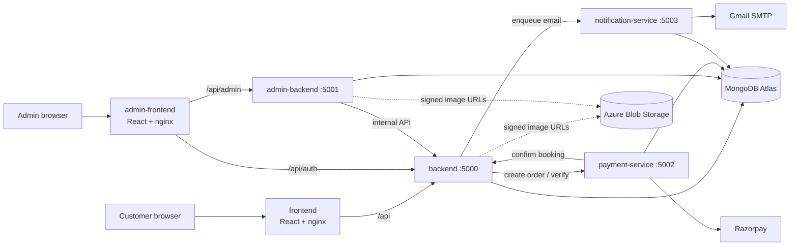

# HomeEase — application

HomeEase is a home-services marketplace. Customers browse services (electrician, plumbing, carpentry, spa & salon, security, repair), book a time slot, pay online, and get matched to the nearest available professional. Admins manage users, services, professionals and bookings from a separate console.

This repository holds the **application code and its CI**. Infrastructure lives in `Infrastructure_Homeease` (Terraform) and deployment configuration in `gitops_homeease` (Helm + Argo CD).

## Architecture



| Service | Port | Responsibility | Database |
|---|---|---|---|
| `frontend` | 8080 | Customer SPA, served by nginx; proxies `/api` to the backend | – |
| `admin-frontend` | 8080 | Admin SPA; proxies `/api/admin` and `/api/auth` | – |
| `backend` | 5000 | Auth, service catalogue, bookings, slot reservation, professional matching, emergency requests, background scheduler, business metrics | `homeease_booking` |
| `admin-backend` | 5001 | Admin API (users, services, professionals, bookings, emergencies); calls the backend's internal API | `homeease_admin` |
| `payment-service` | 5002 | Razorpay orders, signature verification, webhooks, refunds | `homeease_payment` |
| `notification-service` | 5003 | Transactional email through a database outbox with retry and exponential backoff | `homeease_notification` |

Each service owns its own database, so a service can be changed, scaled or restarted on its own. Services call each other over HTTP with timeouts, and internal routes are protected by a shared `INTERNAL_SERVICE_TOKEN`.

## How a booking works

A booking moves through `Created → Assigned → Confirmed → Completed`, or to `Cancelled` from any active state. A state machine rejects any other transition, so a booking can never be confirmed or completed without a professional.

1. The customer picks a service, an area and a slot. The backend reserves the slot (`SlotReservation`) so two customers cannot take the same one, and creates the booking as `Created`.
2. The backend claims the nearest available professional in that category who covers the area, using the distance between areas. The claim is a single atomic database update, so two bookings cannot grab the same person.
3. For online payment, the backend asks `payment-service` for a Razorpay order. After the customer pays, the signature is verified and the booking becomes `Confirmed`. Cash bookings are confirmed immediately.
4. `notification-service` emails the customer and the professional. A failed send is retried with exponential backoff rather than lost.
5. When the job is done the booking is `Completed` and the professional becomes available again.
6. A scheduler cancels unpaid online bookings after 15 minutes, cancels bookings nobody could be assigned to once their slot starts, reassigns waiting bookings when a professional frees up, and retries pending refunds. A MongoDB lease lets only one backend instance run it at a time, so the backend can scale to several instances.

## Tech stack

Node.js 22, Express 5, Mongoose 9, JWT with bcrypt, helmet and `express-rate-limit`, pino JSON logs, prom-client metrics. Frontends are React 18 with Vite. Payments use Razorpay, mail uses Nodemailer, and images are stored in Azure Blob Storage with short-lived signed URLs.

## Run locally

```bash
docker compose up --build
```

Customer site: <http://localhost:8080> · Admin console: <http://localhost:8081>. Compose also starts a local MongoDB. To run a service without Docker, copy its `.env.example` to `.env`, then `npm ci && npm run dev`. Create the first admin with `npm run seed:admin` in `backend/`.

`backend/scripts/migrations/` holds the service-catalogue seed data and image mapping for a fresh database. `scripts/local-db-split/` splits a single local database into the four per-service databases.

## Configuration

Every service validates its environment on start. The settings that matter most:

| Variable | Used by | Purpose |
|---|---|---|
| `MONGO_URI` | all four backends | Mongo connection string, with a different database name per service |
| `JWT_SECRET` | backend, admin-backend | Signs and verifies login tokens |
| `INTERNAL_SERVICE_TOKEN` | all four backends | Authenticates service-to-service calls; internal routes are open when unset, so set it in production |
| `RAZORPAY_KEY_ID`, `RAZORPAY_KEY_SECRET`, `RAZORPAY_WEBHOOK_SECRET` | backend, payment-service | Payments |
| `AZURE_STORAGE_ACCOUNT_NAME`, `AZURE_STORAGE_ACCOUNT_KEY` | backend, admin-backend | Image storage |
| `EMAIL_USER`, `EMAIL_PASS`, `EMAIL_FROM` | notification-service | Gmail address, app password and sender name |
| `ALLOWED_ORIGINS` | backend, admin-backend, payment-service | Extra browser origins allowed by CORS |
| `TRUST_PROXY_HOPS` | backend, admin-backend | Number of proxies in front, so the rate limiter sees the real client IP |
| `RATE_LIMIT_AUTH_MAX`, `RATE_LIMIT_GENERAL_MAX`, `RATE_LIMIT_PAYMENT_MAX`, `RATE_LIMIT_EMERGENCY_MAX` | backend | Requests allowed per IP per 15 minutes |
| `CLOUDWATCH_EMF_ENABLED`, `METRICS_COLLECTOR_ENABLED` | backend, payment-service | Business metrics for CloudWatch and Prometheus |

## Observability

Every service exposes `/health/live`, `/health/ready` and `/metrics`. Business gauges (bookings, users, revenue, payments) are read from MongoDB, so they stay correct across restarts and multiple instances. On Azure they are scraped by Prometheus and shown in Grafana; on AWS they are published to CloudWatch as embedded metrics. Request logs are structured JSON with a request id.

## Tests and quality gates

```bash
cd backend && npm test        # likewise for each service
```

Backends use Node's built-in test runner with coverage; the frontends use Vitest. Tests run without a database. Every pull request is gated by Gitleaks (secrets), Hadolint (Dockerfiles), ESLint, unit tests, `npm audit`, SonarQube, and Trivy scans of the files and the built image.

## CI/CD

| Pipeline | File | What it does |
|---|---|---|
| Azure DevOps | `azure-pipelines.yml` | Static checks → validate → build, scan and push to ACR → promote the new tag into `gitops_homeease` → verify the rollout → publish CI metrics. Argo CD then deploys to AKS |
| GitHub Actions | `.github/workflows/aws-ci.yml` | The same checks, then builds, signs (cosign, keyless) and pushes to ECR and commits the new tag into `Infrastructure_Homeease`. Terraform then deploys to ECS |

Only the services whose files changed are built. Images are tagged with the commit SHA and are immutable. One-time Azure DevOps setup is in `.azuredevops/README.md`.

## Repository layout

```
backend/  admin-backend/  payment-service/  notification-service/   Node services
frontend/  admin-frontend/                                            React apps
.azuredevops/        Reusable pipeline templates and setup notes
.github/workflows/   AWS pipeline
scripts/             SonarQube helpers and the local database splitter
docker-compose.yml   Full local stack
```
