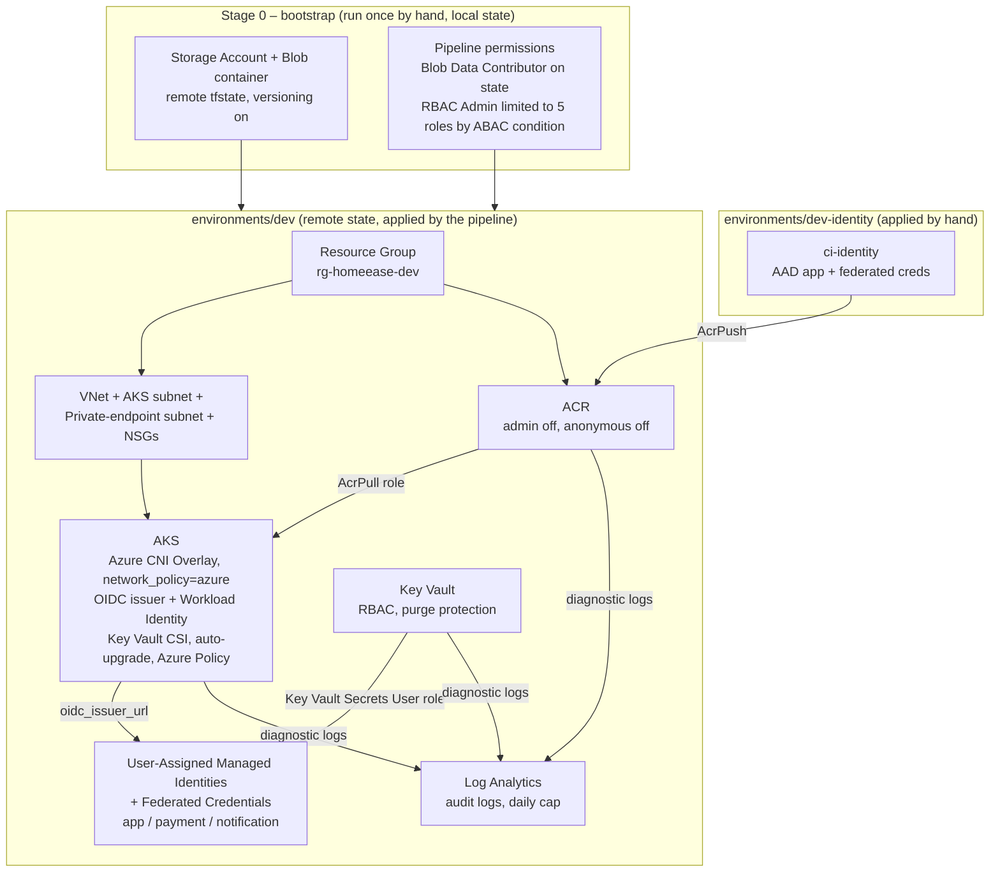

                        
   ## 2. Infrastructure layer (Terraform → Azure)

**Why three Terraform roots (the answer to "why three folders"):**
| Root | Applied by | Why separate |
|---|---|---|
| `bootstrap/` | you, once, local state | creates the remote state itself (chicken-and-egg) and the pipeline's own permissions, which must survive a dev destroy |
| `environments/dev-identity/` | you, by hand | creates an Entra ID app registration; the pipeline has no directory permissions on purpose |
| `environments/dev` (+ staging, prod) | the Azure DevOps pipeline | everything else; state key per environment |

Key design points to say on camera:
- Modular: `modules/{resource-group,networking,monitoring,acr,aks,keyvault,workload-identity,ci-identity}` reused by `environments/{dev,staging,prod}`.
- Remote state in Azure Blob (created by `bootstrap/`), Azure AD auth only (no storage keys), blob-lease **state locking**.
- No passwords anywhere: the pipeline uses **workload identity federation**, pods use **Workload Identity**.
- Pipeline identity is least-privilege: it can assign only AcrPull, AcrPush, Key Vault Secrets User/Officer and Blob Data Contributor (ABAC condition), and has no Entra ID directory rights.
- Production safeguards: delete locks on ACR, Key Vault and AKS (prod only), audit logs to Log Analytics, budget alerts.
- AWS (ECS Fargate / EKS reference) is written but **not applied** – say so honestly.                     
                        
                        
                        
                        
                        
                        
                        
                        
                        
                        
                        
                        
                        
                        
                        
                        
                        
                        
                        
                        
                        
                        
                        
                        
                        
                        
                        
                        
                        
                        
                        
                        
                        
                        
                        
                        
                        
                        
                        
                        
                        
                        
                        
                        
                        
                        
                        
                        
                        
                        
                        
                        
                        
                         ┌──────────────────────┐
                         │       CUSTOMER       │
                         └──────────┬───────────┘
                                    │
                                    ▼
                         ┌──────────────────────┐
                         │   CUSTOMER FRONTEND  │
                         │       React          │
                         └──────────┬───────────┘
                                    │
                                    │ REST API
                                    ▼
                         ┌──────────────────────┐
                         │       BACKEND        │
                         │    Node / Express    │
                         │                      │
                         │ Auth • Services      │
                         │ Booking • Emergency  │
                         │ Business Logic       │
                         └───────┬───────┬──────┘
                                 │       │
                   ┌─────────────┘       └──────────────┐
                   │                                    │
                   ▼                                    ▼
          ┌──────────────────┐                 ┌──────────────────┐
          │ PAYMENT SERVICE  │                 │ NOTIFICATION     │
          │                  │                 │ SERVICE          │
          │ Payment Logic    │                 │ Notification     │
          └────────┬─────────┘                 │ Delivery         │
                   │                           └────────┬─────────┘
                   ▼                                    ▼
          ┌──────────────────┐                 ┌──────────────────┐
          │ PAYMENT PROVIDER │                 │ EMAIL / NOTIFY   │
          └──────────────────┘                 │ PROVIDER         │
                                               └──────────────────┘

                                 │
                                 ▼
                        ┌──────────────────┐
                        │     MongoDB      │
                        │ Application Data │
                        └────────┬─────────┘
                                 │
                              imageKey
                                 │
                                 ▼
                       ┌────────────────────┐
                       │ Azure Blob Storage │
                       │   Service Images   │
                       └────────────────────┘

              ┌──────────────────────┐
              │        ADMIN         │
              └──────────┬───────────┘
                         ▼
              ┌──────────────────────┐
              │   ADMIN FRONTEND     │
              │        React         │
              └──────────┬───────────┘
                         ▼
              ┌──────────────────────┐
              │    ADMIN BACKEND     │
              │ Auth / Permissions   │
              │ Management / Audit   │
              └──────────┬───────────┘
                         ▼
                    Application
                       Data

CI Pipeline :

                  ┌──────────────────────┐
                  │   app_Homeease       │
                  │ Application + CI/CD  │
                  └──────────┬───────────┘
                             │
                         Git Push
                             │
                             ▼
                 ┌────────────────────────┐
                 │ 1. STATIC              │
                 │ Gitleaks               │
                 │ Hadolint               │
                 │ Change Detection       │
                 └───────────┬────────────┘
                             ▼
                 ┌────────────────────────┐
                 │ 2. VALIDATE             │
                 │ npm ci                  │
                 │ ESLint                  │
                 │ Unit/API tests          │
                 │ npm audit               │
                 │ Trivy FS                │
                 │ SonarCloud              │
                 └───────────┬────────────┘
                             ▼
                 ┌────────────────────────┐
                 │ 3. PACKAGE              │
                 │ Docker Build            │
                 │ Trivy Image             │
                 │ SBOM / Syft             │
                 │ Push                    │
                 └───────────┬────────────┘
                             │
                             ▼
              ┌──────────────────────────────┐
              │ Azure Container Registry     │
              │ acrhomeeasedev01.azurecr.io  │
              │                              │
              │ homeease/backend:<git-sha>   │
              │ homeease/frontend:<git-sha>  │
              │ ...                          │
              └──────────────┬───────────────┘
                             │
                             ▼
                 ┌────────────────────────┐
                 │ 4. PROMOTE             │
                 │ GitOps repo            │
                 │ image.tag = Git SHA    │
                 └───────────┬────────────┘
                             │
                             ▼
                  ┌─────────────────────┐
                  │ Gitops_Homeease     │
                  │ Helm values         │
                  └─────────┬───────────┘
                            │
                            ▼
                     ┌─────────────┐
                     │   Argo CD   │
                     │ Auto Sync   │
                     │ Self Heal   │
                     └──────┬──────┘
                            ▼
                     ┌─────────────┐
                     │ AKS DEV     │
                     │ HomeEase    │
                     └──────┬──────┘
                            ▼
                    5. VERIFY DEV
                    health + smoke
                            │
                            ▼
                    6. CI METRICS
                      Pushgateway
                            │
                            ▼
                  Prometheus / Grafana

