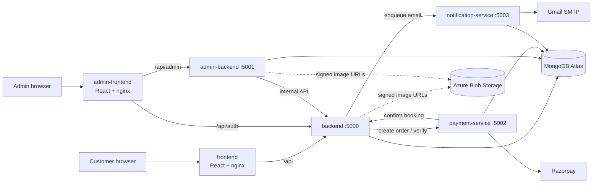

# HomeEase — application

HomeEase is a home-services marketplace. Customers browse services (electrician, plumbing, carpentry, spa & salon, security, repair), book a time slot, pay online, and get matched to the nearest available professional. Admins manage users, services, professionals and bookings from a separate console.

This repository holds the **application code and its CI**. Infrastructure lives in `Infrastructure_Homeease` (Terraform) and deployment configuration in `gitops_homeease` (Helm + Argo CD).

## What I did

- Built the application as six services (four Node.js backends and two React frontends) with Docker and a local compose setup.
- Wrote the CI pipelines in Azure DevOps and GitHub Actions.
- Wrote the Terraform for Azure (AKS) and AWS (ECS).
- Set up GitOps deployment with Helm and Argo CD.
- Added monitoring with Prometheus, Grafana, Loki and CloudWatch.

## Other repositories

- Infrastructure (Terraform, infra pipelines): https://github.com/SrinidhiSanjeevi/Infrastruture_Homeease
- GitOps (Helm charts, Argo CD, monitoring stack): https://github.com/SrinidhiSanjeevi/Gitops_Homeease

## Live demo

| | Customer | Admin |
|---|---|---|
| Azure | https://homeease-app.centralindia.cloudapp.azure.com | https://homeease-admin.centralindia.cloudapp.azure.com |
| AWS | https://d1dtc9ngh4fly7.cloudfront.net | https://d3vprnd9vqtd6q.cloudfront.net |

Grafana, Alertmanager, Argo CD and CloudWatch links are in the parent folder's `README.md`.

## Architecture



| Service | Port | Responsibility | Database |
|---|---|---|---|
| `frontend` | 8080 | Customer SPA, served by nginx; proxies `/api` to the backend | – |
| `admin-frontend` | 8080 | Admin SPA; proxies `/api/admin` and `/api/auth` | – |
| `backend` | 5000 | Auth, service catalogue, bookings, slot reservation, professional matching, emergency requests, background scheduler, business metrics | `homeease_booking` |
| `admin-backend` | 5001 | Admin API (users, services, professionals, bookings, emergencies); calls the backend's internal API | `homeease_admin` |
| `payment-service` | 5002 | Razorpay orders, signature verification, webhooks, refunds | `homeease_payment` |
| `notification-service` | 5003 | Transactional email through a database outbox with retry and exponential backoff | `homeease_notification` |

Each service owns its own database, so a service can be changed, scaled or restarted on its own. Services call each other over HTTP with timeouts, and internal routes are protected by a shared `INTERNAL_SERVICE_TOKEN`.

## Tech stack

Node.js 22, Express 5, Mongoose 9, JWT with bcrypt, helmet and `express-rate-limit`, pino JSON logs, prom-client metrics. Frontends are React 18 with Vite. Payments use Razorpay, mail uses Nodemailer, and images are stored in Azure Blob Storage with short-lived signed URLs.

## Run locally

```bash
docker compose up --build
```

Customer site: <http://localhost:8080> · Admin console: <http://localhost:8081>. Compose starts a local MongoDB too.

## Observability

- **App:** every service exposes `/health/live`, `/health/ready` and `/metrics`, writes structured JSON logs with a request id, and publishes business numbers (bookings, users, revenue, payments) read from MongoDB.
- **Azure:** Prometheus scrapes the metrics, Grafana shows six dashboards (business, payment, RED/Kubernetes, DORA, logs, alerts), Loki and Alloy collect logs, and Alertmanager emails alerts.
- **AWS:** the same numbers go to CloudWatch as embedded metrics, with four dashboards, alarms, Logs Insights and an SNS email topic.
- **DORA:** a custom exporter turns pipeline history into deployment frequency, lead time and failure rate.

## Tests and quality gates

```bash
cd backend && npm test        # likewise for each service
```

Backends use Node's built-in test runner with coverage; the frontends use Vitest. Tests run without a database. Every pull request is gated by Gitleaks (secrets), Hadolint (Dockerfiles), ESLint, unit tests, `npm audit`, SonarQube, and Trivy scans of the files and the built image.

## CI/CD

| Pipeline | File | What it does |
|---|---|---|
| Azure DevOps | `azure-pipelines.yml` | Static checks → validate → build, scan and push to ACR → promote the new tag into `gitops_homeease` → verify the rollout → publish CI metrics. Argo CD then deploys to AKS |
| GitHub Actions | `.github/workflows/aws-ci.yml` | The same checks, then builds, signs (cosign, keyless) and pushes to ECR and commits the new tag into `Infrastructure_Homeease`. Terraform then deploys to ECS |

Only the services whose files changed are built. Images are tagged with the commit SHA and are immutable. One-time Azure DevOps setup is in `.azuredevops/README.md`.

