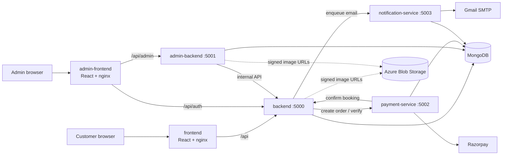

# HomeEase — application

HomeEase is a home-services marketplace. Customers browse services (electrician, plumbing, carpentry, spa & salon, security, repair), book a time slot, pay online and get matched to the nearest available professional. They can also raise an emergency request that is dispatched straight to a professional. Admins manage users, services, professionals, bookings and emergencies from a separate console.

This repository holds the **application code** (six services), its **Docker images** and its **CI pipelines** for Azure and AWS.

## Live links

| Environment | Customer site | Admin console |
|---|---|---|
| Azure — AKS | https://homeease-app.centralindia.cloudapp.azure.com | https://homeease-admin.centralindia.cloudapp.azure.com |
| AWS — EKS | https://d1c07dtmd5gx45.cloudfront.net | https://d3220hgmchhivu.cloudfront.net |
| AWS — ECS Fargate (first AWS version, legacy) | https://d1dtc9ngh4fly7.cloudfront.net | https://d3vprnd9vqtd6q.cloudfront.net |

| Tool | Link |
|---|---|
| GitHub Actions (AWS CI) | https://github.com/SrinidhiSanjeevi/app_Homeease/actions |
| Azure DevOps (Azure CI) | https://dev.azure.com/homeease/HomeEase/_build |
| SonarCloud (code quality, one project per service) | https://sonarcloud.io/organizations/srinidhisanjeevi/projects |
| CloudWatch dashboards (Fargate) | [business](https://ap-south-1.console.aws.amazon.com/cloudwatch/home?region=ap-south-1#dashboards/dashboard/homeease-dev-business-overview) · [payments](https://ap-south-1.console.aws.amazon.com/cloudwatch/home?region=ap-south-1#dashboards/dashboard/homeease-dev-payment-service) · [RED / ECS](https://ap-south-1.console.aws.amazon.com/cloudwatch/home?region=ap-south-1#dashboards/dashboard/homeease-dev-red-ecs) · [logs](https://ap-south-1.console.aws.amazon.com/cloudwatch/home?region=ap-south-1#dashboards/dashboard/homeease-dev-logs) |

Grafana, Prometheus/Alertmanager and Argo CD are not exposed publicly. Open them with a port-forward on the cluster:

```bash
kubectl -n monitoring port-forward svc/kube-prometheus-stack-grafana 3000:80          # Grafana      http://localhost:3000
kubectl -n monitoring port-forward svc/kube-prometheus-stack-alertmanager 9093:9093   # Alertmanager http://localhost:9093
kubectl -n argocd port-forward svc/argocd-server 8443:443                             # Argo CD      https://localhost:8443 (AKS only)
```

## Related repositories

- [Infrastruture_Homeease](https://github.com/SrinidhiSanjeevi/Infrastruture_Homeease) — Terraform for the AKS, EKS and ECS Fargate environments.
- [Gitops_Homeease](https://github.com/SrinidhiSanjeevi/Gitops_Homeease) — Helm charts and Argo CD apps; CI in this repo writes the new image tags there.

## Architecture



| Service | Port | Responsibility | Database |
|---|---|---|---|
| `frontend` | 8080 | Customer SPA served by nginx; proxies `/api` to the backend | – |
| `admin-frontend` | 8080 | Admin SPA; proxies `/api/admin` and `/api/auth` | – |
| `backend` | 5000 | Auth, service catalogue, bookings, slot reservation, professional matching, emergency requests, background scheduler, business metrics | `homeease_booking` |
| `admin-backend` | 5001 | Admin API (users, services, professionals, bookings, emergencies) with permissions and an audit log; calls the backend's internal API | `homeease_admin` |
| `payment-service` | 5002 | Razorpay orders, signature verification, webhooks, refunds | `homeease_payment` |
| `notification-service` | 5003 | Transactional email through a database outbox with retries | `homeease_notification` |

## Concepts implemented

**Microservices with a database per service.** Each service owns its own MongoDB database (MongoDB Atlas in the cloud, a container locally), so it can be changed, scaled or restarted on its own. Services talk over HTTP with timeouts. Internal routes require a shared `X-Internal-Token` (`INTERNAL_SERVICE_TOKEN`), compared in constant time.

**Booking lifecycle.**
- A state machine allows only valid moves: `created → assigned → confirmed → completed`, or `cancelled` from any of those.
- A unique index on (professional, date, time slot) makes double booking impossible, even with two requests at the same moment.
- The matcher picks the nearest available professional in the right category.
- Price includes 18% GST.
- Cancelling is free up to 2 hours before the slot; after that a 20% fee applies.
- Unpaid bookings expire automatically.

**Emergency requests** have their own state machine and are dispatched to a matching professional immediately.

**Background scheduler.** It expires unpaid bookings and runs other periodic jobs. When several backend pods run, a lease document in MongoDB lets only one pod run each tick, and another takes over if that pod dies.

**Payments.**
- payment-service creates the Razorpay order and verifies the payment signature (HMAC) before telling the backend to confirm the booking.
- Webhooks are verified with their own secret.
- Refunds go through the same service, so no other service holds Razorpay keys.

**Notifications (outbox pattern).**
- Emails are written to a `notifications` collection first, then sent.
- A failed send is retried up to 3 times with exponential backoff (2, 4, 8 s… capped at 30 s), so an SMTP outage does not lose emails.

**Security.**
- **Login and sessions:** JWT access tokens (15 min) with refresh tokens, bcrypt password hashes, and TOTP two-factor login for admins.
- **Admin access:** admin-only routes with fine-grained permission checks, and an audit log of admin actions.
- **Request hardening:** helmet headers, input validation on every route, CORS allow-list, and per-route rate limits (general, auth, payment, emergency).
- **Images:** stored in Azure Blob Storage and served through short-lived signed URLs.

**Observability built into every service.**
- `/health/live` and `/health/ready` for the orchestrator's probes.
- `/metrics` in Prometheus format.
- Structured JSON logs (pino) with a request id that follows a call across services.
- Business numbers (bookings, revenue, users, payment success) are read from the database, not counted in memory, so they stay correct across restarts and multiple pods.
- With `CLOUDWATCH_EMF_ENABLED=true` the same numbers are written as CloudWatch Embedded Metric Format, which is how the Fargate dashboards get them.

## Tech stack

Node.js 22, Express 5, Mongoose 9, JWT + bcrypt, helmet, `express-rate-limit`, pino, prom-client. Frontends are React 18 with Vite 5. Razorpay for payments, Nodemailer for email, Azure Blob Storage for images.

## Run locally

```bash
for s in backend admin-backend payment-service notification-service; do cp $s/.env.example $s/.env; done
# set JWT_SECRET (same value in backend and admin-backend) and INTERNAL_SERVICE_TOKEN (same in all four)
docker compose up --build
```

- Customer site: <http://localhost:8080> · Admin console: <http://localhost:8081>.
- Compose starts MongoDB and points every service at it; no Atlas account is needed.
- First admin: set `INITIAL_ADMIN_EMAIL` / `INITIAL_ADMIN_PASSWORD` in `backend/.env`, then `docker compose exec backend node scripts/seedAdmin.js`.
- Razorpay and Gmail values are only needed to test payments and email.
- One service without Docker: `cd backend && npm ci && npm run dev` (frontends: `npm run dev`, Vite on port 5173).

## Docker

Every service has its own multi-stage `Dockerfile` and `.dockerignore`, built the same way:

| | Build stage | Runtime stage |
|---|---|---|
| 4 Node backends | `node:22-alpine`, `npm ci --omit=dev` | `node:22-alpine` with only `node_modules` and the code |
| 2 React frontends | `node:22-alpine`, `npm ci` + `npm run build` | `nginx-unprivileged` serving `dist/` with our own `nginx.conf` |

**Hardening:**
- `apk upgrade` at build time.
- npm and npx are deleted from the runtime image.
- The app runs as a non-root user (`homeease`, UID 1001, or `nginx`).
- `dumb-init` runs as PID 1 so `SIGTERM` stops Node cleanly.
- A `HEALTHCHECK` is defined in every image.
- `.dockerignore` keeps `.env`, `.git`, tests and `node_modules` out of the build context.

## Tests and quality gates

```bash
cd backend && npm test && npm run lint     # same in every service folder
```

Backends use Node's built-in test runner with coverage; frontends use Vitest. Tests need no database.

| Service | Tests | Line coverage |
|---|---|---|
| backend | 119 | 68% |
| admin-backend | 82 | 96% |
| payment-service | 50 | 98% |
| notification-service | 46 | 99% |
| frontend / admin-frontend | 15 / 13 | utility modules (`authFetch`, validators) |

Every pull request is gated by Gitleaks (secrets, whole history), Hadolint (Dockerfiles), ESLint, unit tests, `npm audit --audit-level=high`, a SonarCloud quality gate, and Trivy scans of the source tree and of the built image. On GitHub, `main` is protected: the "Static analysis" and "Validate" checks must pass before a merge.

## CI/CD

Two pipelines do the same job on two clouds. **CI never deploys to a cluster.** It writes the new image tag into the GitOps repository, and Argo CD rolls it out.


| | Azure DevOps — `azure-pipelines.yml` | GitHub Actions — `.github/workflows/aws-ci.yml` |
|---|---|---|
| Registry | ACR, workload identity federation (no stored keys) | ECR, GitHub OIDC role (no stored AWS keys) |
| Image signing | – | cosign keyless signature on the pushed digest |
| Promotes to | `charts/<svc>/values-azure-dev.yaml` | `charts/<svc>/values-aws-dev.yaml` |
| Deployed by | Argo CD (on AKS) to AKS | the same Argo CD, to EKS (cluster `eks-dev`) |
| After deploy | Verify DEV, CI metrics to Pushgateway, approval-gated STAGING and PROD preview stages | job duration metric to Pushgateway |

**Steps:**
1. **Static.**
   - Gitleaks scans the whole git history.
   - Hadolint lints all six Dockerfiles.
   - Change detection works out which service folders changed, so only those services are built. A pipeline change rebuilds everything.
   - Draft PRs are skipped.
2. **Validate**, one parallel job per changed service: `npm ci`, ESLint, unit tests, `npm audit`, a production build for the frontends, a Trivy filesystem scan and the SonarCloud quality gate.
3. **Package.**
   - Buildx builds with layer caching and OCI labels.
   - Trivy scans the image; any fixable HIGH or CRITICAL finding fails the build.
   - A CycloneDX SBOM is generated.
   - On `main` only, the image is pushed, tagged with the 12-character commit SHA. Tags are never reused, so every image traces back to its commit.
4. **Promote.** CI clones the GitOps repo, changes one line (`image.tag`) per changed service, commits and pushes. If parallel promotions collide, the push is retried on the latest `main`.
5. **Verify DEV.** After Argo CD rolls out, the pipeline polls `/health/live` until the backend reports the new version, then checks `/health/ready` and both frontends.
6. **Report.** Job durations and results go to the Prometheus Pushgateway and feed the Grafana DORA dashboard.

**Why it is built this way:**
- Every change is traceable from commit to image to GitOps commit to pod.
- A rollback is a `git revert` in the GitOps repo.
- Scans run before anything is pushed.
- Pipelines never hold cluster credentials.

One-time Azure DevOps setup (GitHub token, approval environments) is in [`.azuredevops/README.md`](.azuredevops/README.md).
