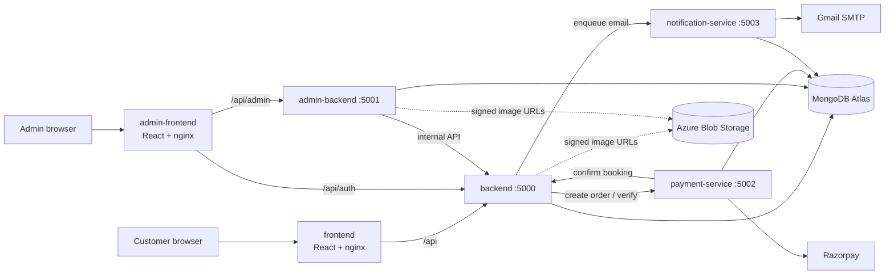
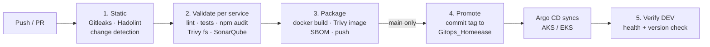

# HomeEase — application

HomeEase is a home-services marketplace. Customers browse services (electrician, plumbing, carpentry, spa & salon, security, repair), book a time slot, pay online, and get matched to the nearest available professional. Admins manage users, services, professionals and bookings from a separate console.

This repository holds the **application code and its CI**. Infrastructure lives in `Infrastructure_Homeease` (Terraform) and deployment configuration in `gitops_homeease` (Helm + Argo CD).

## What I did

- Built the application as six services (four Node.js backends and two React frontends) with Docker and a local compose setup.
- Wrote the CI pipelines in Azure DevOps and GitHub Actions.
- Wrote the Terraform for Azure (AKS) and AWS (ECS).
- Set up GitOps deployment with Helm and Argo CD.
- Added monitoring with Prometheus, Grafana, Loki and CloudWatch.

## Other repositories

- Infrastructure (Terraform, infra pipelines): https://github.com/SrinidhiSanjeevi/Infrastruture_Homeease
- GitOps (Helm charts, Argo CD, monitoring stack): https://github.com/SrinidhiSanjeevi/Gitops_Homeease

## Live demo

| | Customer | Admin |
|---|---|---|
| Azure | https://homeease-app.centralindia.cloudapp.azure.com | https://homeease-admin.centralindia.cloudapp.azure.com |
| AWS | https://d1dtc9ngh4fly7.cloudfront.net | https://d3vprnd9vqtd6q.cloudfront.net |

Grafana, Alertmanager, Argo CD and CloudWatch links are in the parent folder's `README.md`.

## Architecture



| Service | Port | Responsibility | Database |
|---|---|---|---|
| `frontend` | 8080 | Customer SPA, served by nginx; proxies `/api` to the backend | – |
| `admin-frontend` | 8080 | Admin SPA; proxies `/api/admin` and `/api/auth` | – |
| `backend` | 5000 | Auth, service catalogue, bookings, slot reservation, professional matching, emergency requests, background scheduler, business metrics | `homeease_booking` |
| `admin-backend` | 5001 | Admin API (users, services, professionals, bookings, emergencies); calls the backend's internal API | `homeease_admin` |
| `payment-service` | 5002 | Razorpay orders, signature verification, webhooks, refunds | `homeease_payment` |
| `notification-service` | 5003 | Transactional email through a database outbox with retry and exponential backoff | `homeease_notification` |

Each service owns its own database, so a service can be changed, scaled or restarted on its own. Services call each other over HTTP with timeouts, and internal routes are protected by a shared `INTERNAL_SERVICE_TOKEN`.

## Tech stack

Node.js 22, Express 5, Mongoose 9, JWT with bcrypt, helmet and `express-rate-limit`, pino JSON logs, prom-client metrics. Frontends are React 18 with Vite. Payments use Razorpay, mail uses Nodemailer, and images are stored in Azure Blob Storage with short-lived signed URLs.

## Run locally

```bash
docker compose up --build
```

Customer site: <http://localhost:8080> · Admin console: <http://localhost:8081>. Compose starts a local MongoDB too.

## Observability

- **App:** every service exposes `/health/live`, `/health/ready` and `/metrics`, writes structured JSON logs with a request id, and publishes business numbers (bookings, users, revenue, payments) read from MongoDB.
- **Azure:** Prometheus scrapes the metrics, Grafana shows six dashboards (business, payment, RED/Kubernetes, DORA, logs, alerts), Loki and Alloy collect logs, and Alertmanager emails alerts.
- **AWS:** the same numbers go to CloudWatch as embedded metrics, with four dashboards, alarms, Logs Insights and an SNS email topic.
- **DORA:** a custom exporter turns pipeline history into deployment frequency, lead time and failure rate.

## Tests and quality gates

```bash
cd backend && npm test        # likewise for each service
```

Backends use Node's built-in test runner with coverage; the frontends use Vitest. Tests run without a database. Every pull request is gated by Gitleaks (secrets), Hadolint (Dockerfiles), ESLint, unit tests, `npm audit`, SonarQube, and Trivy scans of the files and the built image.

## Docker and CI/CD — 5-minute walkthrough

### 1. Docker (about 2 minutes)

Each of the six services has its own `Dockerfile` and `.dockerignore`. All of them follow the same rules.

**Multi-stage builds.** The first stage installs dependencies. The second stage is the small image that actually runs.

| | Build stage | Runtime stage |
|---|---|---|
| 4 Node backends | `node:22-alpine`, `npm ci --omit=dev` (production dependencies only) | `node:22-alpine` with only `node_modules` and the code copied in |
| 2 React frontends | `node:22-alpine`, `npm ci` + `npm run build` (Vite) | `nginx-unprivileged` serving the static `dist/` folder with our own `nginx.conf` |

**Hardening in the runtime image:**
- `apk upgrade` patches OS packages at build time.
- **npm and npx are deleted**, so nothing can install packages inside a running container.
- The app runs as a **non-root user**: `homeease` (UID 1001) for the backends, `nginx` for the frontends. Files are copied in with `--chown`.
- **`dumb-init`** runs as PID 1 and forwards signals, so `SIGTERM` from Kubernetes or ECS shuts Node down cleanly.
- A **`HEALTHCHECK`** calls `/health/live` on the backends and `/health` on nginx.
- `.dockerignore` keeps `.env`, `.git`, tests, coverage and `node_modules` out of the build context. This keeps secrets out of images and keeps builds fast.

**Local run with `docker-compose.yml`.** One command (`docker compose up --build`) starts all six services and MongoDB on a private bridge network.
- Only the two frontends publish ports: 8080 and 8081. The backends use `expose`, so they can't be reached from the host.
- `depends_on: condition: service_healthy` sets the start order: Mongo, then backend, then the other services, then the frontends.
- Every container has memory and CPU limits and `restart: unless-stopped`.

### 2. CI/CD (about 3 minutes)

There are two pipelines that do the same thing on two clouds. **CI never deploys to a cluster directly.** It only writes the new image tag into Git, and the cluster pulls it (GitOps).



| | Azure DevOps — `azure-pipelines.yml` | GitHub Actions — `.github/workflows/aws-ci.yml` |
|---|---|---|
| Registry | ACR (`acrhomeeasedev01`), workload identity federation | ECR, OIDC role (no stored AWS keys) |
| Image signing | – | cosign keyless signature on the pushed digest |
| Promotes to | `charts/<svc>/values-azure-dev.yaml` in Gitops_Homeease | `charts/<svc>/values-aws-dev.yaml` in Gitops_Homeease (or the Fargate tfvars in Infrastructure_Homeease when `AWS_DEPLOY_TARGET=fargate`) |
| Deployed by | Argo CD on AKS | Argo CD on EKS |
| After deploy | Verify DEV stage, CI metrics to Pushgateway, approval-gated STAGING → PROD preview stages | Push duration metric to Pushgateway |

**Step by step:**
1. **Static.** Gitleaks scans the **whole git history** for secrets. Hadolint lints all six Dockerfiles. Change detection works out which service folders changed, so **only those services are built**. A pipeline change rebuilds everything. Draft PRs are skipped.
2. **Validate** (one parallel job per changed service). `npm ci`, ESLint, unit tests, `npm audit --audit-level=high`, a production build for the frontends, a **Trivy filesystem scan** (vulnerabilities, secrets, misconfigurations) and a **SonarQube** quality gate.
3. **Package.** Buildx builds the image with layer caching and OCI labels (source repo, commit, created date). The image is then scanned with **Trivy**: any fixable HIGH or CRITICAL finding fails the build. A **CycloneDX SBOM** is generated. On `main` only, the image is pushed, tagged with the **12-character commit SHA**, so tags are never reused and every image can be traced back to its commit.
4. **Promote.** CI clones `Gitops_Homeease`, runs `yq`/`sed` to change one line (`image.tag`) for each changed service, then commits and pushes. Several services can promote in parallel, so a rejected push is retried on top of the latest `main`.
5. **Argo CD** sees the commit and rolls out the new pods. **Verify DEV** polls `/health/live` until the backend reports the new version, then checks `/health/ready` and both frontends.
6. **Report.** Job durations and pass/fail results go to the Prometheus Pushgateway. These numbers feed the Grafana DORA dashboard.

**Why it's built this way:** every change can be traced from commit to image to GitOps commit to pod. A rollback is just a `git revert` in the GitOps repo. Scans run before anything is pushed. Pipelines never hold cluster credentials.

One-time Azure DevOps setup is in `.azuredevops/README.md`.
